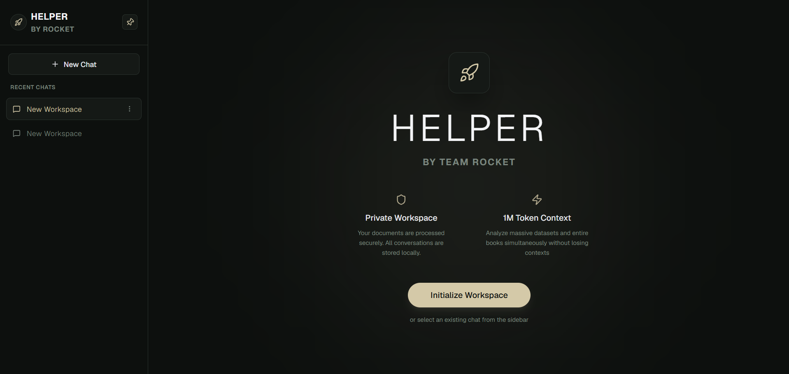
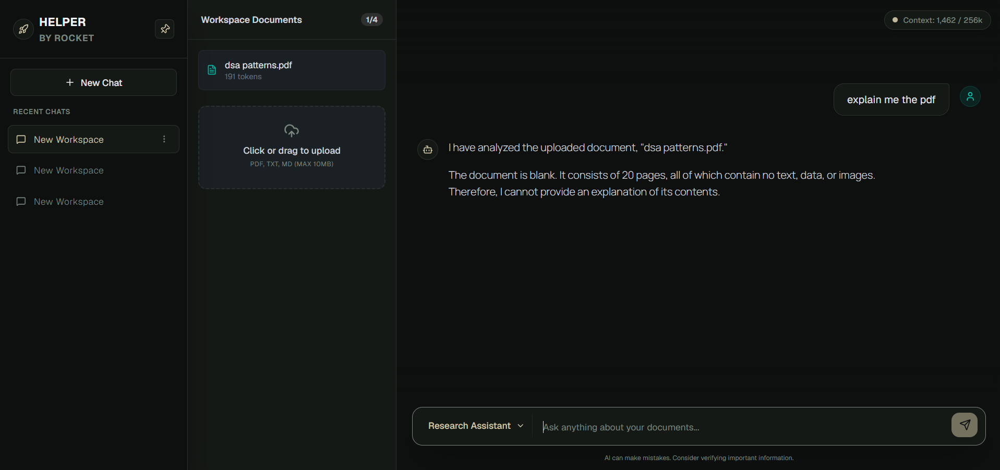

# 🚀 HELPER by Team Rocket

> **A Multi-Format AI Document Workspace powered by Google's Gemini Long Context Models**


---

# 🌐 Live Demo

> Replace the frontend URL below with your latest Amplify/custom domain.

**Frontend:** `https://deployment-aws.d218n5u6p5g5uy.amplifyapp.com/`

**Backend API:** `https://helper-vhni.onrender.com`

---

# 📖 Overview

HELPER is an AI-powered document analysis platform that allows users to upload documents and interact with them using natural language.

Unlike traditional document chatbots that rely primarily on Retrieval-Augmented Generation (RAG), HELPER adopts a **Long-Context Architecture**, sending complete document content directly to Gemini's context window (within supported limits). This enables richer reasoning, better contextual understanding, and improved responses for technical documents, research papers, manuals, and reports.

---

# ✨ Features

- 📄 PDF document upload
- 💬 Multi-session AI workspace
- ⚡ Real-time AI response streaming using Server-Sent Events (SSE)
- 🧠 Long-context document reasoning
- 🎭 AI Persona selection
- 📊 Live token usage tracking
- 🔄 Automatic conversation history management
- 📝 Export chat history as Markdown
- 🎨 Clean three-pane responsive interface
- 🚀 Production deployment (AWS Amplify + Render)

---

# 🖼 Screenshots

```md





```

---

# 🏗 Architecture

```text
                 User Browser
                      │
                      ▼
        AWS Amplify (React + Vite)
                      │
                      ▼
         Render (Node.js + Express)
          │                     │
          ▼                     ▼
 MongoDB Atlas Cloud     Google Gemini API
```

---

# 🛠 Tech Stack

## Frontend

- React (Vite)
- Tailwind CSS
- JavaScript
- Fetch API

## Backend

- Node.js
- Express.js
- MongoDB
- Mongoose
- Google Gemini API
- Multer

## DevOps

- Docker
- Docker Compose
- AWS Amplify
- Render
- MongoDB Atlas

---

# 📂 Project Structure

```text
IBMProject.PDF
│
├── Backend
│   ├── src
│   ├── uploads
│   ├── Dockerfile
│   ├── package.json
│   └── server.js
│
├── Frontend
│   ├── src
│   ├── public
│   ├── Dockerfile
│   ├── package.json
│   └── vite.config.js
│
├── docker-compose.yml
└── README.md
```

---

# ⚙ Prerequisites

- Git
- Docker Desktop (recommended)
- Node.js 22+ (manual setup)
- Google Gemini API Key
- MongoDB Atlas account (production) or MongoDB Atlas Local (development)

---

# 🚀 Running the Project

## Option 1 — Docker (Recommended)

Clone the repository:

```bash
git clone https://github.com/chill4lyfe/IBMProject.PDF.git
cd IBMProject.PDF
```

Create `Backend/.env`

```env
PORT=8000
NODE_ENV=development

GEMINI_API_KEY=YOUR_API_KEY

CHAT_MODEL=gemini-3.1-flash-lite

MONGODB_URI=mongodb://mongo:27017/askpdf

CORS_ORIGIN=http://localhost:5173
```

Run:

```bash
docker compose up --build
```

Application:

Frontend

```
http://localhost:5173
```

Backend

```
http://localhost:8000
```

---

## Option 2 — Manual Setup

### Backend

```bash
cd Backend
npm install
npm run dev
```

### Frontend

```bash
cd Frontend
npm install
npm run dev
```

Start MongoDB Atlas Local (or use Atlas Cloud):

```bash
docker run -d --name local-mongo -p 27017:27017 mongodb/mongodb-atlas-local:latest
```

---

# ☁ Production Deployment

## Frontend

- AWS Amplify

## Backend

- Render

## Database

- MongoDB Atlas

## AI Model

- Google Gemini Flash Lite

Environment Variables (Render):

```env
PORT=8000

GEMINI_API_KEY=YOUR_API_KEY

CHAT_MODEL=gemini-3.1-flash-lite

MONGODB_URI=YOUR_MONGODB_ATLAS_URI

CORS_ORIGIN=https://YOUR-AMPLIFY-URL.amplifyapp.com
```

Environment Variables (Amplify):

```env
VITE_API_URL=https://helper-vhni.onrender.com/api
```

---

# 🔥 API Endpoints

## Documents

| Method | Endpoint |
|---------|----------|
| POST | /api/documents/upload |
| GET | /api/documents/session/:id |
| DELETE | /api/documents/:id |

## Chat

| Method | Endpoint |
|---------|----------|
| POST | /api/chat/ask |
| GET | /api/chat/history/:sessionId |
| DELETE | /api/chat/history/:sessionId |

---

# ⚡ Streaming

The AI responses are streamed using **Server-Sent Events (SSE)**, allowing users to receive responses token-by-token for a smooth conversational experience.

---

# 📊 Token Tracking

The backend continuously tracks:

- Document Tokens
- Chat History Tokens
- Total Context Tokens

This prevents exceeding Gemini's supported context window.

---

# 🔐 Environment Variables

| Variable | Purpose |
|----------|---------|
| PORT | Backend port |
| NODE_ENV | Runtime mode |
| GEMINI_API_KEY | Google Gemini API key |
| CHAT_MODEL | Gemini model |
| MONGODB_URI | MongoDB connection string |
| CORS_ORIGIN | Allowed frontend URL |
| VITE_API_URL | Backend API URL (frontend) |

---

# 🐳 Useful Docker Commands

```bash
docker compose up
docker compose up -d
docker compose down
docker compose restart
docker compose logs -f
docker compose up --build
```

---

# 🛠 Troubleshooting

### Docker not running

Start Docker Desktop before running Docker commands.

### Port already in use

```bash
netstat -ano | findstr :8000
taskkill /PID <PID> /F
```

### Rebuild

```bash
docker compose down
docker compose up --build
```

---

# 🗺 Roadmap

- Google Context Caching
- Hybrid RAG Pipeline
- OCR Support
- Image Understanding
- Multi-document reasoning
- Authentication
- Team collaboration
- Search across conversations

---

# 👨‍💻 Team

**Team Rocket**

IBM SkillsBuild Project

Built with ❤️ using React, Node.js, MongoDB Atlas, Google Gemini, Docker, AWS Amplify, and Render.

---

# 📄 License

Licensed under the **GNU General Public License v3.0**.

See the [LICENSE](LICENSE) file for details.
