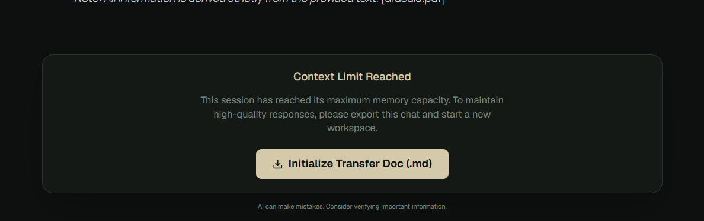

# HELPER by Team Rocket


---

# Try HELPER
https://main.d218n5u6p5g5uy.amplifyapp.com

---

## Meet our Multi-Format Document AI Workspace.
Helper is not just another ChatGPT wrapper. It is a premium, zero-auth, multi-session AI workspace designed to leverage the absolute power of large token context AIs by implementing **Long-Context LLM Pipeline**.

We didn't rely on traditional RAG, because of its chunking of large scale documents, we were directly hitting too many requests on the free tier. To leverage the million tokens context windows that we now get for free, our HELPER uses a **Brute-Force Context Architecture**. It feeds your entire document, directly into the AI's memory, allowing for unparalleled complex reasoning and deep document analysis.

---

## UI/UX & Features
- Multi-session zero-auth AI workspace
- Real-time AI response streaming using Server-Sent Events (SSE)
- Long-context document reasoning
- Multiple well-polished Personas
- Real time context token tracking
- Get a clean chat export option on reaching session limit
- Complex AI responses, code blocks, and tables rendered beautifully (remark-gfm).
- Deployed on free tier using Amplify(frontend) and EC2 virtual servers (Backend). (limits to 6 months of live deployment)


## Snapshots
Home Screen:


Chat Session:


Session Limit Reached:


## Tech Stack
**Frontend:**
*   React (Vite)
*   Tailwind CSS v4 (Custom  architectures)

**Backend:**
*   Node.js & Express
*   MongoDB & Mongoose
*   Google Gemini API
*   Multer (Document handling)

**DevOps:**
* Docker
* AWS Amplify
* AWS EC2 virtual servers
* MongoDB Atlas

---

# Project Structure

```
askPDF
├── Backend
│   ├── src
│   ├── uploads
│   ├── Dockerfiles
│   ├── package.json
│   └── server.js
│
├── Frontend
│   ├── src
│   ├── public
│   ├── Dockerfile
│   ├── package.json
│   └── vite.config.js
│
├── docker-compose.prod.yml
├── docker-compose.yml
├── LICENSE
└── README.md
```
---

### IBM SkillsBuild Project
Built with ❤️ by Team Rocket

---
Licensed under the **GNU General Public License v3.0**. See the [LICENSE](LICENSE) file for details.
